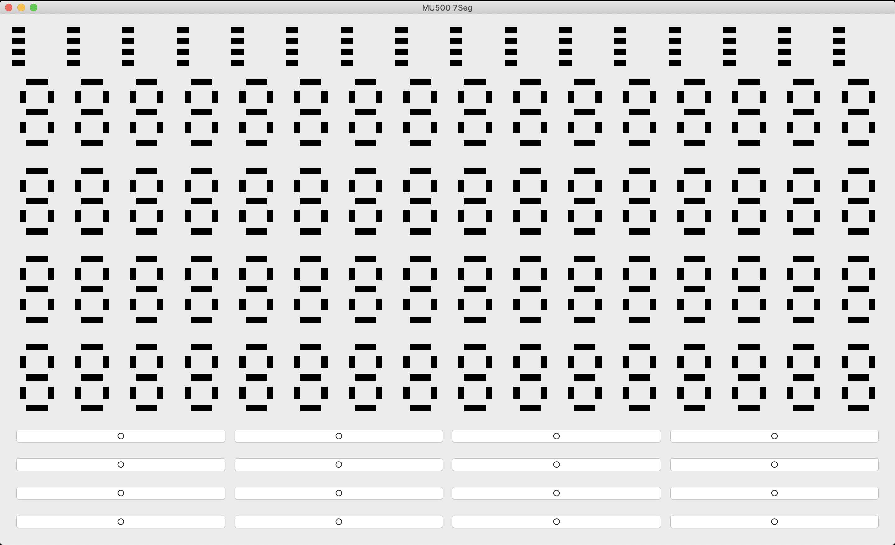
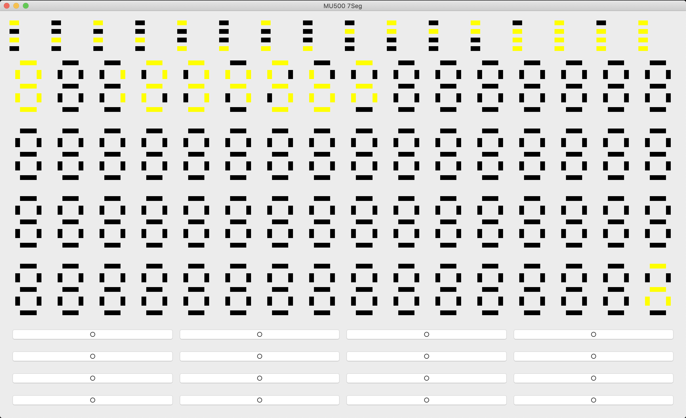

# MU500-7SEG エミュレータ
## 概要
7SEGのLEDの動作をエミュレートするプログラム。
メモリマップ形式で7SEGの操作が可能である。

## パッケージのインストール
MU500エミュレータに `PyQT5` という `Python` のパッケージを使っているので、コードを実行する前に、Terminal (Mac OS)・Powershell / Windows Terminal (Windows) で、以下のコマンドを実行することで必要なパッケージインストールする。

※ 2種類のインストール方法があって、どれも大丈夫。

### 方法 1: パッケージ名指定でインストール
```bash
$ pip install PyQt5
```

### 方法 2: `requirements.txt` でインストール

```bash
$ pip install -r requirements.txt
```

## 使い方
### 7SEGのLEDエミュレータの起動
コードでLEDを変化する前に、MU500-7SEG エミュレータを起動する必要がある。

```bash
$ python mu500_7seg.py
```

上記のコマンドを実行すると、以下のようなウィンドウが開かれる。

<figure>
    
    <figcaption>7SEG LED のエミュレータ</figcaption>
</figure>

### LED を点灯させてみる
`$ python mu500_7seg.py` を実行した Terminal の他に、もう1つの Terminal を開いて、以下のコマンドで `test.py` を実行してみる。

※ 1つ目の Terminal を終了させてしまうと、MU500-7SEG エミュレータも終了してしまうので、別の Terminal を用いてコードの実行を行う。

```bash
$ python test.py
```

<figure>
    
    <figcaption><code>test.py</code> を実行した後のエミュレータ</figcaption>
</figure>

### エミュレータの操作方法 (Python)
MU500-7SEG エミュレータになにかを表示したい場合には、文字列で `"XXYY"` と送信する。
これはバスアクセスを模しており、`XX` は `0x04000000` からの16進数表現されたオフセットである。
`YY` はか16進数表現された書き込む内容である。
例えば、`"00FF"` を送信すると1つ目の7セグLEDがすべて点灯する。

具体的に、`test.py` に定義されている関数 `send()` を用いて文字列の `"XXYY"` をエミュレータに送信する。

#### send() 関数
```python
# offset: XX (0x04000000 からのオフセット)
# byte: YY (書き込む内容)
def send(offset, byte):
    str = offset + byte + ";"
    sock.sendto(str.encode('utf-8'), addr)
    print("sent: " + str)
```

#### send() の使い方
例えば、1つ目の7SEGのLEDにすべて点灯させる場合、下記のコード (いずれか) を実行すれば良い。

```python
send("00", "FF")

# または

send("00", 0b11111111)

# または

send("00", 0xFF)
```